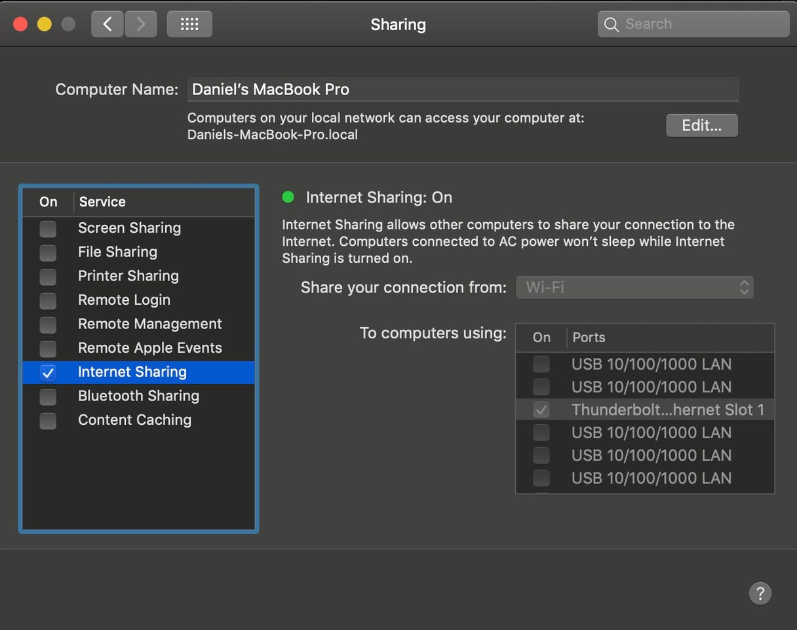

# Sharing network from mac to clock???8001                                                                                                       
                                                                                                                                                 
Connect the computer to the clock via cable.
Connect the computer to wifi.

Go to settings/sharing

Select the interface and shared connection (wifi)
Turn on Internet sharing.
Start the clock???8001

As soon as the clock has the correct time you can stop sharing and disconnect, it will keep the time until rebooted.